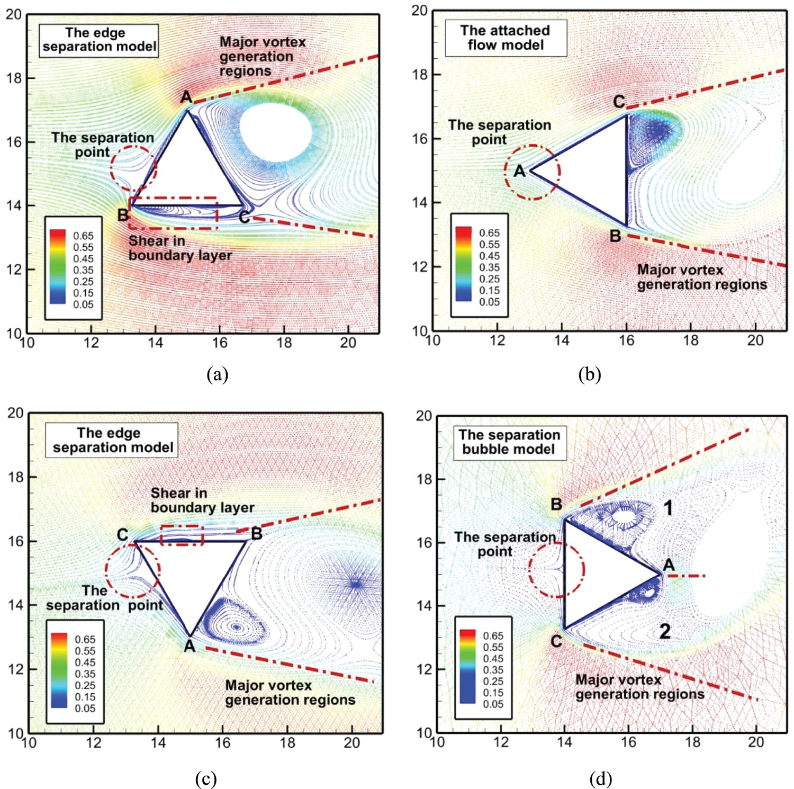

# Ballute Testing
## Brief
During my time at Monash High Powered Rocketry I designed a high alttitude recovery parachute. This is a novel concept called a ballute. For more details see the [report section](../ballute.md) I wrote on it. 

The parachute was designed for a 100,000 ft (30 km) rocket. A ballute was selected over a traditional drogue parachute due to the inability to model low density inflation dynamics that could lead to a irrecoverable canopy collapse. The ballute addresses this problem by using an inflatable design that can inherently not enter an unstable collapsed configuration, using the weight of the rocket to allign vents with incoming airflow. 

Now that I have graduated others will carry on the final manufacturing and testing of the ballute. I want to manufacture this parachute at home to test it, purely out of curiosity and passion.

## Goals and Expectations
There are a few things I want to get from manufacturing and testing this parachute.

### Manufacturability 
Clearly this is a strange parachute, and it will be strange to make. It has been made on the hobby level and [professional level](https://www.youtube.com/watch?v=4WhBfoOEUjY) so it is certainly possible. The student team is currently manufacturing one, the steps are clear and feasible. I wish to try and improve upon this process and find downfalls that can be improved through trial and error.

### Behaviour
The ballute is a device made for high subsonic and supersonic airflow, so its behaviour in lower speed regimes is of great interest. Companies such as [Copenhagen Sub-orbitals](https://copenhagensuborbitals.com/) have done low speed drop tests and the ballute performed well, inflating and effectively slowing the payloads descent. Doing further drop tests will validate estimates of inflation pressure at certain flight stages as detailed in the [report](../ballute.md). Additionally, physically verifying the ballute remains positively pressured at low speeds is a great sanity check for the final stage of descent for this parachute before the main parachute deploys.

## Aerodynamic Conversation?
Before manufacturing the ballute I'd like to write some qualitative discussion on CFD that was conducted for this parachute to better understand the flow characteristics around the parachute. While the simulation could be improved, it will still provide valuable insights. 

The parameters for the below simulation are:
* Airspeed 140 $m\ s^{-1}$
* Air Density 0.17 $kg\ m^{-3}$
* Air Dynamic Viscosity  0.00001472 $Pa\ s$ (27 km)
* Reynolds Number 2,368,682 (Ref length 1.456 m) 

The rigid-body airflow simulation of the ballute above, conducted at an airspeed of 129 m/s and an altitude of 27 km, indicates an expected stagnation region along the leading edge of the burble fence, followed by extensive flow separation downstream. This separated flow is the primary mechanism contributing to the ballute’s aerodynamic drag. The resulting pressure distribution may also influence the ballute’s structural deformation, causing the forward surface to flex inward while the aft region bulges outward in response to the lower pressures along the sides.

Comparing this to the potential flow around a cylinder (Due to high Re) the similarities are clear. With stagnation regions fore and aft of the parachute and accelerating flow over the burble fence. 

However the more complex wake characteristics apparent in the CFD simulation are not present for standard cylinder flow. Perhaps looking at a triangular bluff body will reveal the mechanism behind these formations. From a [CFD study on flow fields around equilateral triangles](https://www.tandfonline.com/doi/full/10.1080/19942060.2020.1721332#d1e2168) some further insight can be gained. 

We can see here the flow has a significant free shear layer similar to the ballute where the detached boundary layer from the burble fence creates a harsh gradient between the wake and the free stream. At this point it is wise to mention there is definitely necking in this simulation (is that what it's called?). The boundaries of the simulation domain are clearly not large enough, the constriction of the flow between the ballute and the spanwise domain walls are causing artificial acceleration of the flow which may exaggerate actual flow acceleration.

