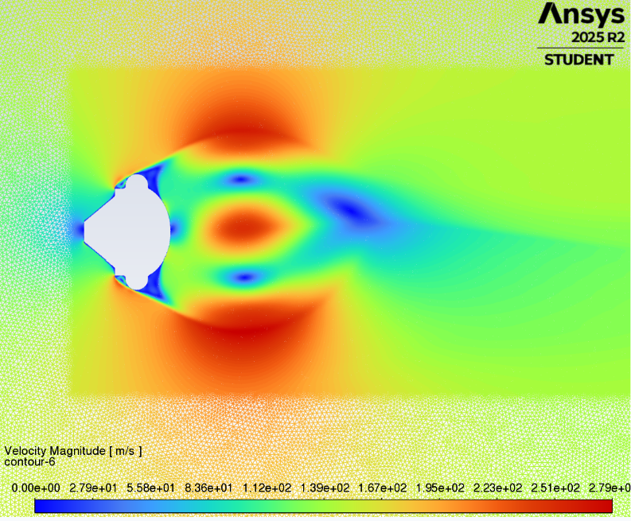

## Ballute Testing
### Brief
During my time at Monash High Powered Rocketry I designed a high alttitude recovery parachute. This is a novel concept called a ballute. For more details see the [report](../ballute.md) I wrote on it. 

The parachute was designed for a 100,000 ft (30 km) rocket. A ballute was selected over a traditional drogue parachute due to the inability to model low density inflation dynamics that could lead to a irrecoverable canopy collapse. The ballute addresses this problem by using an inflatable design that can inherently not enter an unstable collapsed configuration, using the weight of the rocket to allign vents with incoming airflow. 

Now that I have graduated others will carry on the final manufacturing and testing of the ballute. I want to manufacture this parachute at home to test it, purely out of curiosity and passion.

### Goals and Expectations
There are a few things I want to get from manufacturing and testing this parachute.

#### Manufacturability 
Clearly this is a strange parachute, and it will be strange to make. It has been made on the hobby level and [professional level](https://www.youtube.com/watch?v=4WhBfoOEUjY) so it is certainly possible. The student team is currently manufacturing one, the steps are clear and feasible. I wish to try and improve upon this process and find downfalls that can be improved through trial and error.

#### Behaviour

