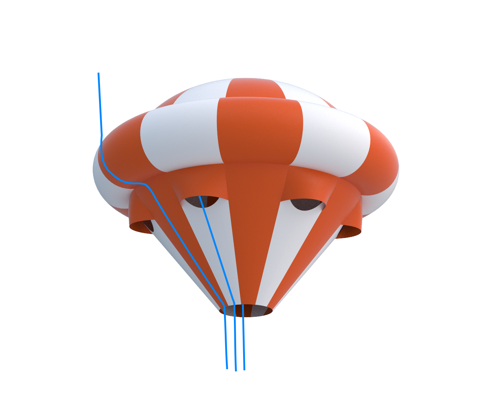

## Ballute Testing
### Brief
During my time at Monash High Powered Rocketry I designed a high alttitude recovery parachute. This is a novel concept called a ballute. For more details see the [report](PortfolioAthanStefanos/ballute.md) I wrote on it. 

The parachute was designed for a 100,000 ft (30 km) rocket. A ballute was selected over a traditional drogue parachute due to the inability to model low density inflation dynamics that could lead to a irrecoverable canopy collapse. The ballute addresses this problem by using an inflatable design that can inherently not enter an unstable collapsed configuration, using the weight of the rocket to allign vents with incoming airflow. 
